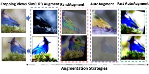
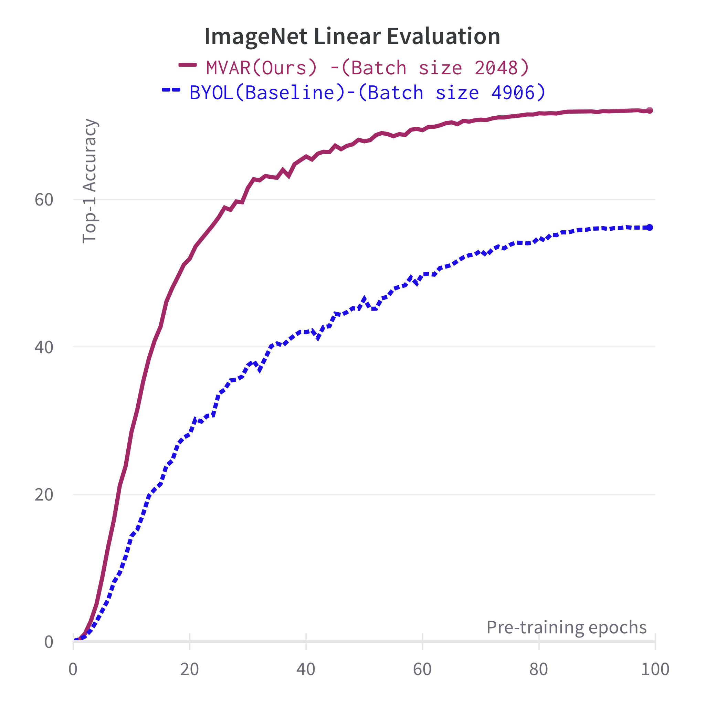
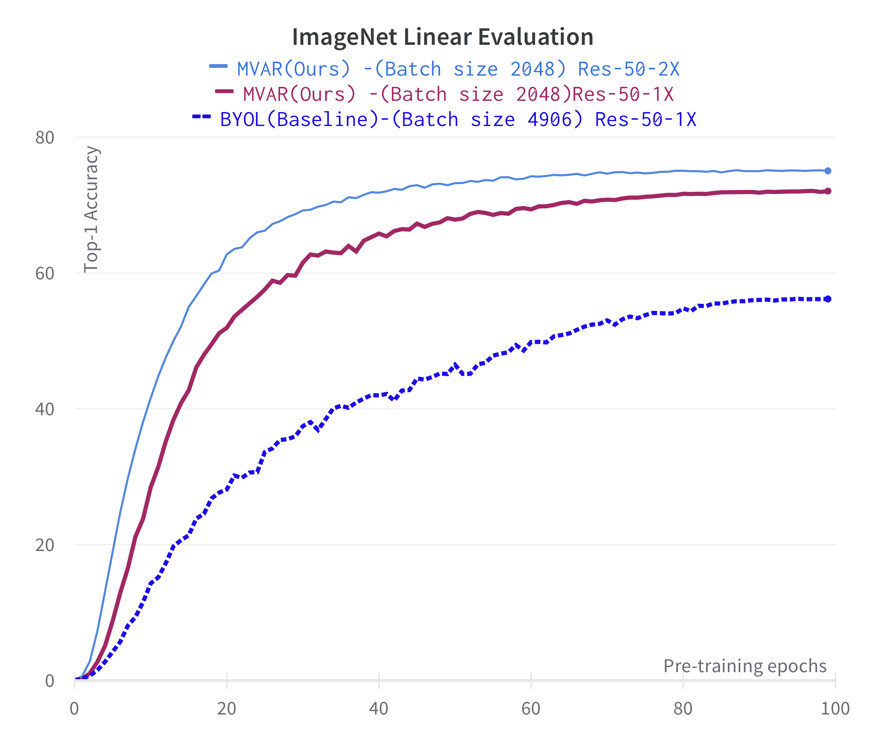
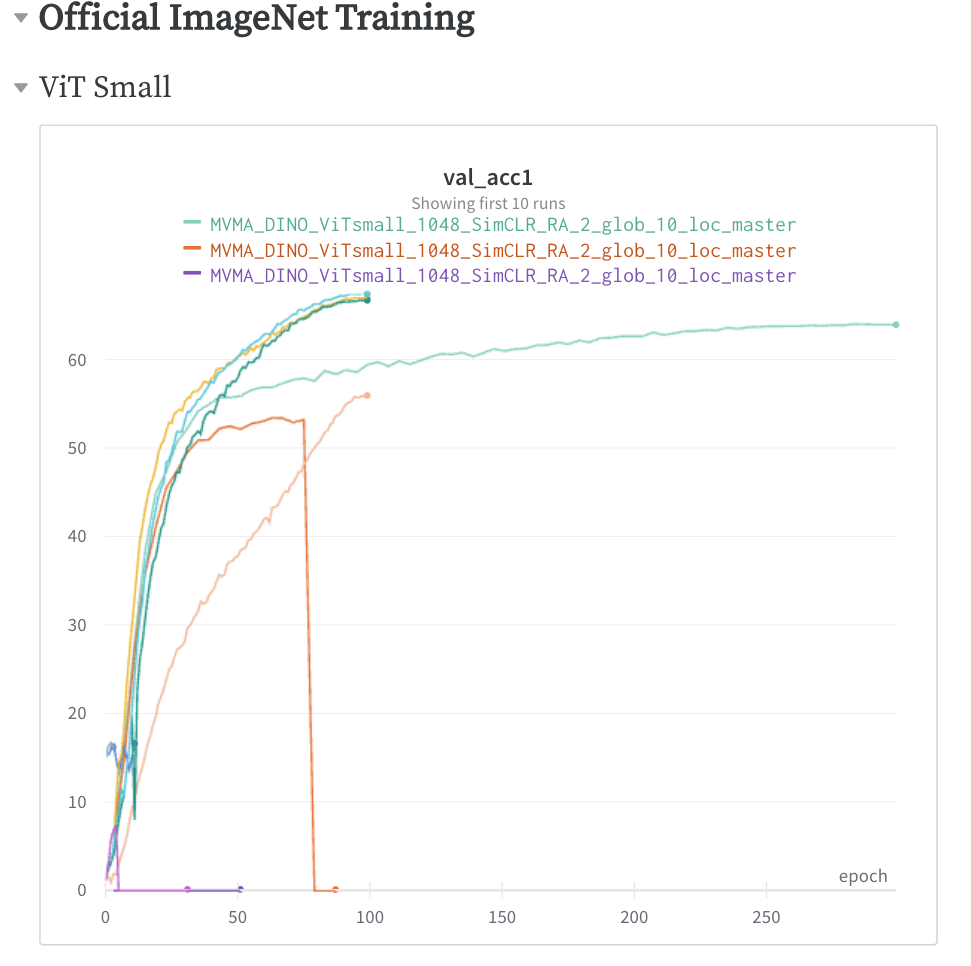

# Multi-View, multi-data augmentation (MVMA_SSRL)

<strong> </strong> The offical implemenation of MVMA (Multi-View, Multi-Augmentation) framework</a>.

  

## Features 

+ Multi-view data augmentation: generate Local and Global views of the same object by Random Cropping.
+ Multi-data augmentation: apply different augmentation techniques to different parts of an image comprising (Random & Searched Policies).
+ Configurable pipeline: easily define your data augmentation pipeline by specifying the desired transformations and their parameters.
+ Batch processing: augment multiple images in parallel to speed up the data generation process.
+ Compatibility: integrate with popular deep learning libraries such as PyTorch and PyTorch Lightning 

# Table of Contents

  - [Installation Requirement](#installation)
  - [Configure Self-Supervised Pretraining](#Setup-self-supervised-pretraining)
    - [Dataset](#Natural-Image-Dataset)
    - [Hyperamters Setting](#Important-Hyperparameter-Setting)
    - [Choosing # augmentation Strategies](#Number-Augmentation-Strategies)
    - [Single or Multi GPUs](#Single-Multi-GPUS)
  - [Pretrained model](#model-weights)
  - [Downstream Tasks](#running-tests)
     - [Image Classification Tasks](#Natural-Image-Classification)
     - [Other Vision Tasks](#Object-Detection-Segmentation)
  - [Contributing](#contributing)
  
 ## Installation

  ### Using pip
  python -m venv myenv
  source myenv/bin/activate
  pip install -r requirements.txt

  ### Using conda
  conda create --name myenv
  conda activate myenv
  conda install --file requirements.txt

## Self-supervised Pretraining

###  Preparing  Dataset: 

**NOTE:** Self-supervised pretraining on the ImageNet dataset. 
+ 1. Download ImageNet-1K dataset (https://www.image-net.org/download.php). Then unzip folder follow imageNet folder structure. 

###  Setting SSL Pretraining Hyperparameter Flags: 
`
Naviaging to the 

bash_files/pretrain/imagenet/MV_MA.sh
`

**1 Changing the dataset directory according to your path**
    `
    --train_dir ILSVRC2012/train \
    --val_dir ILSVRC2012/val \
    
**2 Setting Number of Global and Local Views** 
    -- crop_size_glob 224 \
    -- num_crop_glob 2 \
    --crop_size_loc 94 \
    --num_crop_loc 7 \
 
**3 Setting of Data Augmentation Policies (SimCLR Augmentation Policies,Random Augmentation (RA) Policies, FastAuto Augmentation Policies FA , AutoAugmentation Policies AA)**
  

    
  

  
   --num_augment_trategy SimCLR_FA \  
   --num_augment_strategies 2\

      `
**4 Other Hyperparameters setting** 
  
  - Use a large init learning rate {0.2, 0.3} for `short training epochs`. This would archieve better performance, which could be hidden by the initialization if the learning rate is too small. Use a small init learning rate for Longer training epochs should use value around 0.2.

    `
    --max_epochs 100 \
    --batch_size 256 \
    --lr 0.2 \
    `
**3 Distributed training in 1 Note**

Controlling number of GPUs in your machine by change the --gpus flag
    --gpus 0,1,2,3,4,5,6,7\
    --accelerator gpu \
    --strategy ddp \

## MVMA Pre-trained models  

**1 We open-sourced total 8 pretrained models here **:
+ Augmentation Strategies: AA (AutoAugmentation), FA (FastAuto Augmentation), RA (Random Augmentation), SimAug (SimCLR Augmentation pipeline)
+ These checkpoints are stored in Google Drive Storage:

|   Pre-trained Models | Width   |    Param (M)  | Pretrained epochs| Augmentation Strategies| Linear eval  |
|--------:|--------:|--------:|-------------:|--------------:|--------------:|
| [ResNet50 (1x)](https://drive.google.com/file/d/1IZW3ffuiBKQKX9pdAkHcLyuiTsBeaRXz/view?usp=sharing) | 1X | 24 | 100 | FA |  69.5 |     
| [ResNet50 (1x)](https://drive.google.com/file/d/1I_b5fxrrCkWTOTZl3-YNjJLM-05KqLrn/view?usp=sharing) | 1X  |  24 | 200 |  |  ## |  
| [ResNet50 (1x)](https://drive.google.com/file/d/1IPlgbD_OfEiEKFVTC3jY9DT7FW3gK9RO/view?usp=sharing) | 1X  | 24 | 300 |  |  ## | 

| [ResNet50 (2x)]() | 1X | 24 | 100 | FA |  69.5|   

| [ViT Small](https://drive.google.com/file/d/1IxPCeOKzl5VuB0ktagiiHCAeIdmZXEYT/view?usp=sharing) | 1X  |  22.2 | 100 |  | 70.1 | 
| [ViT Small](https://drive.google.com/file/d/1J-alo3u8h_Iaz8mfpZGbpOpF3gVIQGds/view?usp=sharing) | 1X  | 22.2 | 200 |   | ## |  
| [ViT Small](https://drive.google.com/file/d/1JcQr8Hpe6Q4LHjFiTq_Mn-pRVEefN8LY/view?usp=sharing) | 1X  |  22.2 | 300 |  |  ## |  
| [ViT Base]() | 1X  |  22.2 | 300 |  |  ## |  

**2 Model Performance monitor During Training with attached Linear classification layer  **:
+ MVMA (ResNet-50) Pretraining on 100 Epochs on ImageNet 1k comparision via With BYOL method
  

  

    
  

 
+ MVMA (ResNet-50) Scaling Wider 2x on 100 Epochs on ImageNet 1k comparision via With BYOL method
 

    
  

+ MVMA (ResNet-50) on 300 Epochs on ImageNet 1k comparision via With BYOL method
 
 

    
  

+ ViT Small 
+ ViT Base 

**3 Self-Supervised Pretraining Log** 
  
  

  

    
  

  

    
  

[Report Logs Experiments](https://api.wandb.ai/links/tranrick/n95w8lqn )

## Finetuning the linear head (linear eval)

To fine-tune a linear head (with a single GPU), try the following command:

For fine-tuning a linear head on ImageNet using GPUs, first set the `CHKPT_DIR` to pretrained model dir and set a new `MODEL_DIR`, then use the following command:
`
Stay tune! The instructions will update soon
`

** Performance of Linear Evaluation on ImageNet Validation Set 

Convolution ResNet (ResNet-50) 

## Semi-supervised learning and fine-tuning the whole network

You can access 1% and 10% ImageNet subsets used for semi-supervised learning via [tensorflow datasets](https://www.tensorflow.org/datasets/catalog/imagenet2012_subset): simply set `dataset=imagenet2012_subset/1pct` and `dataset=imagenet2012_subset/10pct` in the command line for fine-tuning on these subsets.

You can also find image IDs of these subsets in `imagenet_subsets/`.

To fine-tune the whole network on ImageNet (1% of labels), refer to the following command:

`
Stay tune! The instructions will update soon
`

## Other resources
update soon

