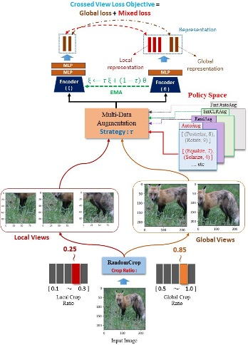

# Multi-View, multi-data augmentation (MVMA_SSRL)

<strong> </strong> This is offical implemenation of MVMA framework</a>.

  

## Features 

+ Multi-view data augmentation: generate Local and Global views of the same object by Random Cropping.
+ Multi-data augmentation: apply different augmentation techniques to different parts of an image comprising (Random & Searched Policies).
+ Configurable pipeline: easily define your data augmentation pipeline by specifying the desired transformations and their parameters.
+ Batch processing: augment multiple images in parallel to speed up the data generation process.
+ Compatibility: integrate with popular deep learning libraries such as PyTorch and PyTorch Lightning 
